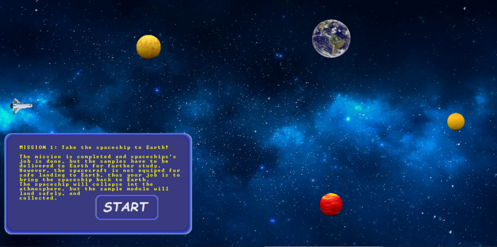

"# HandmadeSpaceGame" 

HOW TO PLAY:
Planets will have gratvitational effect on the space-craft. 
Use up arrow on the keyboard to activate the back thrusters on the spacecraft.
To add angular momentum to the spacecraft, use the right and left arrows.
Back arrow is not used since back thrusters can only push the spacecraft in the universe we used to live in.

HOW IT IS MADE.
This game is written on top of a custom 2D rendering engine that I developed using pure C++ without using any library.
I used the window api to build the rendering engine.
